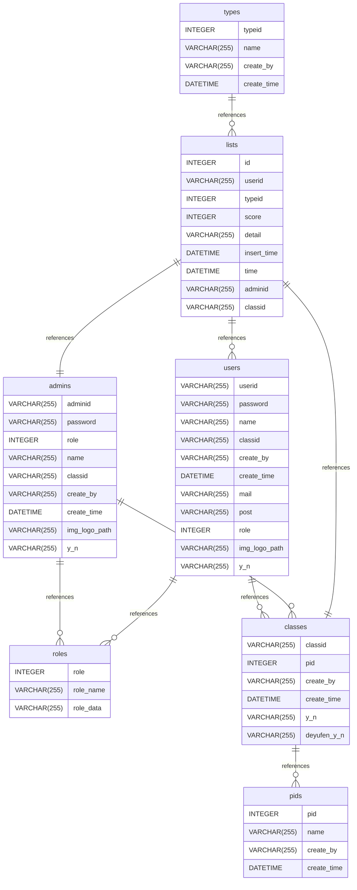

# 关于本项目的数据库
## 目录

- [表结构](#table-structure)
	- [admins](#admins)
	- [classes](#classes)
	- [lists](#lists)
	- [pids](#pids)
	- [roles](#roles)
	- [types](#types)
	- [users](#users)
- [Relationships](#relationships)
- [Database Diagram](#database-Diagram)

- **Database system:** MySQL
## Table structure

### admins

| Name        | Type          | Settings                      | References                    | Note                           |
|-------------|---------------|-------------------------------|-------------------------------|--------------------------------|
| **adminid** | VARCHAR(255) | 🔑 PK, not null  |  |管理员id |
| **password** | VARCHAR(255) | not null  |  |登录密码 |
| **role** | INTEGER | not null  | admins_role_fk |管理员权限等级 |
| **name** | VARCHAR(255) | not null  |  |管理员的名字 |
| **classid** | VARCHAR(255) | not null  | admins_classid_fk |能够管理哪个班级，只有一个班 |
| **create_by** | VARCHAR(255) | not null  |  |谁创建的该用户，记录的值为用户id或者管理员id |
| **create_time** | DATETIME | not null  |  |创建管理员的时间 |
| **img_logo_path** | VARCHAR(255) | not null  |  |用户头像地址 |
| **y_n** | VARCHAR(255) | not null  |  |是否启用账户，注意api需要严格的权限解析 | 

### classes

| Name        | Type          | Settings                      | References                    | Note                           |
|-------------|---------------|-------------------------------|-------------------------------|--------------------------------|
| **classid** | VARCHAR(255) | 🔑 PK, not null  |  |班级id |
| **pid** | INTEGER | not null  | classes_pid_fk |专业id |
| **create_by** | VARCHAR(255) | not null  |  |谁创建的班级 |
| **create_time** | DATETIME | not null  |  |创建时间 |
| **y_n** | VARCHAR(255) | not null  |  |是否启用班级 |
| **deyufen_y_n** | VARCHAR(255) | not null  |  |是否注册使用德育分系统 | 

### lists

| Name        | Type          | Settings                      | References                    | Note                           |
|-------------|---------------|-------------------------------|-------------------------------|--------------------------------|
| **id** | INTEGER | 🔑 PK, not null  |  | |
| **userid** | VARCHAR(255) | not null  | lists_userid_fk |用户id |
| **typeid** | INTEGER | not null  |  |数据类型(考勤还是纪律...)id |
| **score** | INTEGER | not null  |  |分数变化 |
| **detail** | VARCHAR(255) | not null  |  |记录的内容 |
| **insert_time** | DATETIME | not null  |  |插入数据库的时间 |
| **time** | DATETIME | not null  |  |记录内容的发生时间 |
| **adminid** | VARCHAR(255) | not null  | lists_adminid_fk |管理员id |
| **classid** | VARCHAR(255) | not null  | lists_classid_fk |班级id | 

### pids

| Name        | Type          | Settings                      | References                    | Note                           |
|-------------|---------------|-------------------------------|-------------------------------|--------------------------------|
| **pid** | INTEGER | 🔑 PK, not null  |  |专业id，自增 |
| **name** | VARCHAR(255) | not null  |  |专业的名字，例如：软件与信息服务 |
| **create_by** | VARCHAR(255) | not null  |  |谁创建的，只有权限等级为4的用户才能创建 |
| **create_time** | DATETIME | not null  |  |创建时间 | 

### roles

| Name        | Type          | Settings                      | References                    | Note                           |
|-------------|---------------|-------------------------------|-------------------------------|--------------------------------|
| **role** | INTEGER | 🔑 PK, not null  |  |记录数字1-4，4的权限等级最高 |
| **role_name** | VARCHAR(255) | not null  |  |名字：root:root , admin:admin , admin:user , user:user |
| **role_data** | VARCHAR(255) | not null  |  |权限说明（解释） | 

### types

| Name        | Type          | Settings                      | References                    | Note                           |
|-------------|---------------|-------------------------------|-------------------------------|--------------------------------|
| **typeid** | INTEGER | 🔑 PK, not null  | types_typeid_fk |类型id |
| **name** | VARCHAR(255) | not null  |  |名字 |
| **create_by** | VARCHAR(255) | not null  |  |创建人，只有权限为4的人才能创建 |
| **create_time** | DATETIME | not null  |  |创建或者最后一次更新的时间 | 

### users

| Name        | Type          | Settings                      | References                    | Note                           |
|-------------|---------------|-------------------------------|-------------------------------|--------------------------------|
| **userid** | VARCHAR(255) | 🔑 PK, not null  |  |用户id |
| **password** | VARCHAR(255) | not null  |  |登陆密码 |
| **name** | VARCHAR(255) | not null  |  |用户名 |
| **classid** | VARCHAR(255) | not null  | users_classid_fk |所属班级的id |
| **create_by** | VARCHAR(255) | not null  |  |谁创建的 |
| **create_time** | DATETIME | not null  |  |创建时间 |
| **mail** | VARCHAR(255) | not null  |  |邮箱地址 |
| **post** | VARCHAR(255) | not null  |  |班上担任的职务 |
| **role** | INTEGER | not null  | users_role_fk |用户权限，这张表里面默认为1 |
| **img_logo_path** | VARCHAR(255) | not null  |  |用户头像地址，应当设置默认值 |
| **y_n** | VARCHAR(255) | not null  |  |是否启用此账户（允许登录） | 

## Relationships

- **admins to roles**: many_to_one
- **users to classes**: many_to_one
- **classes to pids**: many_to_one
- **lists to users**: many_to_one
- **types to lists**: many_to_one
- **admins to classes**: many_to_one
- **users to roles**: many_to_one
- **lists to admins**: one_to_one
- **lists to classes**: one_to_one

## Database Diagram

